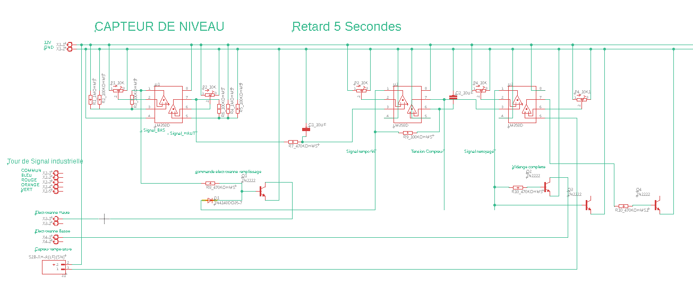

# 💧 100% Analog Smart Water Trough Controller

## 📌 Overview

This project focuses on designing a compact, fully analog electronic control board dedicated to managing an automated livestock water trough.

⚠️ Main Design Constraint:
- No digital components
- No microcontrollers
- 100% analog circuitry

The goal is to build a robust, autonomous, and reliable system capable of operating in harsh agricultural environments while maintaining water hygiene and preventing freezing.

  

---

# ⚙️ System Operation

## 1️⃣ Water Level Management

The system uses two water level probes:

- **Low-level probe** → Detects when the water level is too low
- **High-level probe** → Detects when the optimal level is reached

### Filling Cycle

1. When water drops below the low-level probe:
   - The filling solenoid valve is activated.
2. When water reaches the high-level probe:
   - The valve remains open for an additional 5 seconds (analog timing delay).
3. The filling valve closes.
4. The cycle counter increments.

This process repeats automatically.

---

## 🔄 Automatic Cleaning Cycle

After 10 filling cycles, the system initiates a cleaning sequence:

1. Activation of a drain solenoid valve located under the trough.
2. Complete draining of the trough.
3. Fresh water rinsing phase.
4. Second draining phase.
5. Cycle counter reset.
6. Return to normal filling operation.

🎯 Purpose:
To significantly reduce bacterial growth and maintain clean drinking water for livestock.

  

---

# ❄️ Anti-Freeze Protection System

The board integrates an analog temperature monitoring system.

When the temperature reaches **0°C (32°F)**:

- A heating resistor located at the bottom of the trough is activated.
- The water temperature slightly increases.
- Ice formation on the surface is prevented.

This ensures continuous operation during winter conditions.

---

# 🚦 High-Visibility LED Status Indicators

The system includes industrial multi-color LEDs for long-distance status monitoring.

- 🟢 **Green**  → Normal operation  
- 🟠 **Orange** → Charging / Power state  
- 🔵 **Blue** → Heating active (low temperature detected)  
- 🔴 **Red** → Cleaning cycle in progress  

This allows visual system monitoring from a distance without needing to physically access the trough.

  

---

# 🛠️ Technical Characteristics

- Compact PCB design
- Fully analog architecture
- Analog timing circuits (no digital timers)
- Analog cycle counting system
- Autonomous temperature control
- Designed for agricultural and outdoor environments
- Robust and low-maintenance solution

---

# 🎯 Project Objectives

- Reduce maintenance requirements
- Improve water hygiene
- Ensure reliable winter operation
- Demonstrate complex system design without digital electronics
- Build a durable and field-ready agricultural solution

---

## Project Update - February 19, 2026

### Summary of Additions and Wiring Completed Today

This update covers the integration and wiring of multiple components for an automated water filling and heating system controlled by LM358 op-amps and 2N2222 transistors.

---

### Components and Circuits Added:

1. **5-Second Timer Circuit (LM358 - U2A)**
   - Input (+) connected via R7 (470 kΩ) from Signal_HAUT.
   - Input (−) connected to the wiper of Potentiometer P3 (10 kΩ), with ends to +V and GND.
   - Output provides Signal_TEMPO_FIN after a 5-second delay.

2. **Electrovalve Control for Filling (EV1) - Q1 (2N2222)**
   - Base connected via R8 (4.7 kΩ) to Signal_BAS and diode OR from Signal_TEMPO_FIN.
   - Emitter to GND.
   - Collector to relay coil for EV1.
   - Diode flyback (1N400x) across relay coil.
   - LED indicator with series resistor (1 kΩ) powered at 12 V.

3. **Analog Counter (LM358 - U2B)**
   - Inverting input (pin 6) connected via R9 (100 kΩ) from Signal_TEMPO_FIN and C2 (10 µF) to GND.
   - Non-inverting input (pin 5) to GND.
   - Output (pin 7) outputs Tension_COMPTEUR signal.

4. **Threshold Comparator for 5 Fillings (LM358 - U3A)**
   - Non-inverting input connected to Tension_COMPTEUR.
   - Inverting input connected to Potentiometer P4 (10 kΩ) for threshold setting (~5 V).
   - Output generates Signal_NETTOYAGE.

5. **Electrovalve Control for Draining (EV2) - Q2 (2N2222)**
   - Base connected via R10 (4.7 kΩ) to Signal_NETTOYAGE.
   - Emitter to GND.
   - Collector to relay coil for EV2.
   - Diode flyback and LED indicator similarly connected.

6. **Temperature Sensor and Heating Control**
   - NTC 10 kΩ voltage divider (NTC + R11 10 kΩ) connected to LM358 U3B input (+).
   - Threshold set by Potentiometer P5 (10 kΩ) at input (−).
   - Hysteresis resistor R12 (100 kΩ) between output and inverting input.
   - Output drives base of Q4 (2N2222) transistor via 4.7 kΩ resistor.
   - Q4 controls relay coil for heating element (12 V).
   - Flyback diode on relay coil.
   - Blue LED indicator with series resistor (1 kΩ).

7. **Wiring Notes and Power**
   - All logic circuits powered at 12 V.
   - Electrovalves and heating element powered at 12 V.
   - Common GND shared across logic and power.
   - Flyback diodes mandatory on all relay coils for transistor protection.
   - LEDs connected in parallel with relay coils with suitable resistors.

8. **Connector Footprint**
   - Suggested using 2.54 mm pitch connectors (JST-XH or standard headers) for wiring.
   - In Eagle CAD, look for `JST_XH_2`, `CONN_01x02_2.54mm`, or similar parts for 2-pin connectors.

---

### Summary of Transistor Pinouts Used (2N2222 TO-92):

- Pin 1: Emitter  
- Pin 2: Base  
- Pin 3: Collector  

---

### Next Steps:

- Create full schematic with all components, connectors, wiring, and power rails.
- Verify relay coil and load current ratings.
- Test timing and threshold settings in circuit.
- Finalize PCB footprints and layout.

---

This update completes the wiring and logic control for the filling, draining, counting, and heating functions with detailed transistor driving and protection.

# 🚀 Future Improvements

- Power consumption optimization
- Enhanced waterproof enclosure
- Modular design variants
- Adaptation for different trough sizes
- Industrial certification pathway
