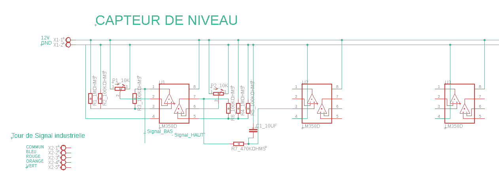
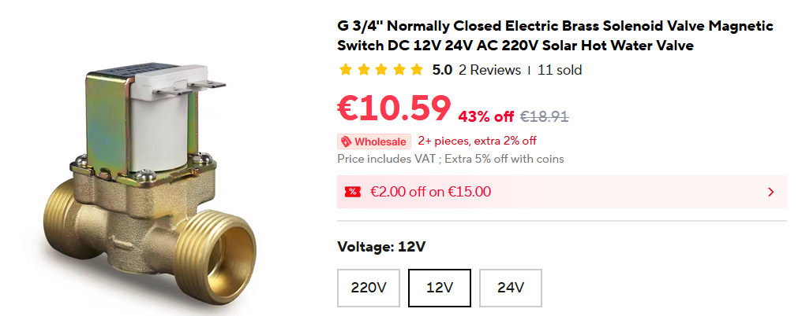
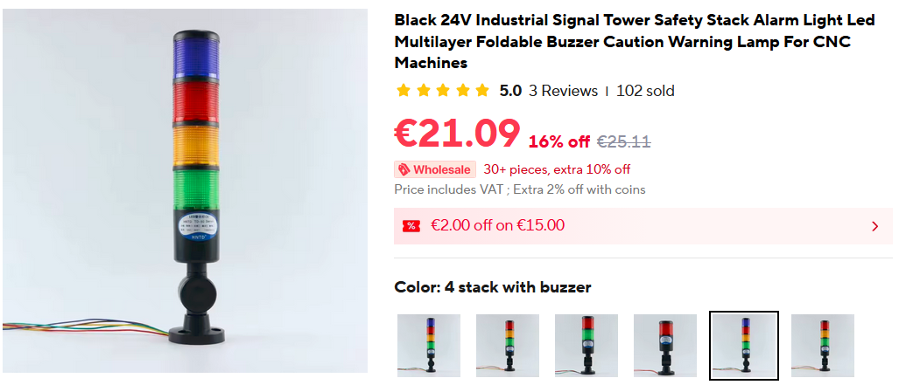

# 💧 100% Analog Smart Water Trough Controller

## 📌 Overview

This project focuses on designing a compact, fully analog electronic control board dedicated to managing an automated livestock water trough.

⚠️ Main Design Constraint:
- No digital components
- No microcontrollers
- 100% analog circuitry

The goal is to build a robust, autonomous, and reliable system capable of operating in harsh agricultural environments while maintaining water hygiene and preventing freezing.

  

---

# ⚙️ System Operation

## 1️⃣ Water Level Management

The system uses two water level probes:

- **Low-level probe** → Detects when the water level is too low
- **High-level probe** → Detects when the optimal level is reached

### Filling Cycle

1. When water drops below the low-level probe:
   - The filling solenoid valve is activated.
2. When water reaches the high-level probe:
   - The valve remains open for an additional 5 seconds (analog timing delay).
3. The filling valve closes.
4. The cycle counter increments.

This process repeats automatically.

---

## 🔄 Automatic Cleaning Cycle

After 10 filling cycles, the system initiates a cleaning sequence:

1. Activation of a drain solenoid valve located under the trough.
2. Complete draining of the trough.
3. Fresh water rinsing phase.
4. Second draining phase.
5. Cycle counter reset.
6. Return to normal filling operation.

🎯 Purpose:
To significantly reduce bacterial growth and maintain clean drinking water for livestock.

  

---

# ❄️ Anti-Freeze Protection System

The board integrates an analog temperature monitoring system.

When the temperature reaches **0°C (32°F)**:

- A heating resistor located at the bottom of the trough is activated.
- The water temperature slightly increases.
- Ice formation on the surface is prevented.

This ensures continuous operation during winter conditions.

---

# 🚦 High-Visibility LED Status Indicators

The system includes industrial multi-color LEDs for long-distance status monitoring.

- 🟢 **Green**  → Normal operation  
- 🟠 **Orange** → Charging / Power state  
- 🔵 **Blue** → Heating active (low temperature detected)  
- 🔴 **Red** → Cleaning cycle in progress  

This allows visual system monitoring from a distance without needing to physically access the trough.

  

---

# 🛠️ Technical Characteristics

- Compact PCB design
- Fully analog architecture
- Analog timing circuits (no digital timers)
- Analog cycle counting system
- Autonomous temperature control
- Designed for agricultural and outdoor environments
- Robust and low-maintenance solution

---

# 🎯 Project Objectives

- Reduce maintenance requirements
- Improve water hygiene
- Ensure reliable winter operation
- Demonstrate complex system design without digital electronics
- Build a durable and field-ready agricultural solution

---

# 🚀 Future Improvements

- Power consumption optimization
- Enhanced waterproof enclosure
- Modular design variants
- Adaptation for different trough sizes
- Industrial certification pathway
